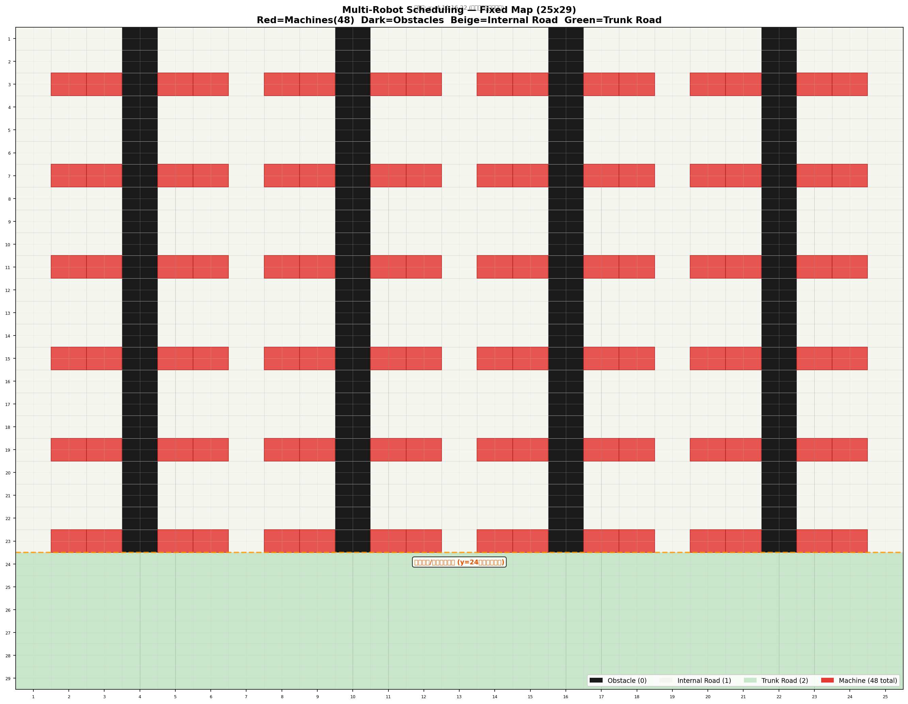

# Multi-Robot Scheduler

面向固定工业地图的多机器人协同调度与无碰撞路径规划系统。项目以 25 × 29 固定地图、48 台离心机和 A/B 两类异构机器人为实验场景，打通任务分配、机器状态管理、时空路径规划、预约表、离散事件仿真与结果可视化。



## v1.0.0 功能

- 2 × 4 footprint 姿态、转移及扫掠区域碰撞验证
- 固定地图、48 台机器与 144 个前序约束操作
- 静态 A* 距离预计算与 Space-Time A* 动态路径规划
- pose、swept、service 三类时空预约
- CP-SAT 任务分配与无 OR-Tools 时的 fallback 策略
- 1A1B 场景离散事件仿真、指标统计和轨迹/甘特图/动画输出
- 单元测试与端到端集成测试

## 环境安装

建议使用 Python 3.11 或更高版本：

```bash
python -m venv .venv
source .venv/bin/activate
python -m pip install -r requirements.txt
```

## 快速开始

运行完整场景：

```bash
python scripts/run_scenario_1_full.py
```

运行测试：

```bash
python -m pytest -q
```

生成地图：

```bash
python scripts/visualize_map.py
```

仿真结果默认写入 `outputs/`。该目录中的运行产物不会纳入版本控制。

## 项目结构

```text
configs/   固定地图配置
docs/      设计与问题修复记录
scripts/   场景运行和可视化脚本
src/       领域模型、地图、求解器、规划、仿真与评估模块
tests/     单元测试、集成测试与验证脚本
```

更完整的设计决策、测试结果和迭代记录见 [PROJECT_LOG.md](PROJECT_LOG.md)。

